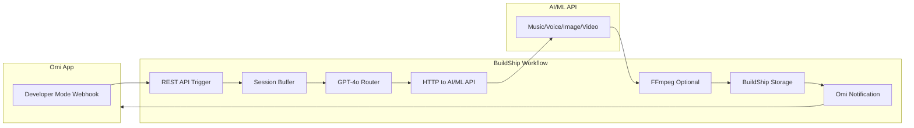

# BuildShip Omi Voice Command Generator (Simple Setup)

## Architecture




## Setup Steps

### 1. Get Your API Keys

- **AI/ML API:** Sign up at https://aimlapi.com, get API key
- **OpenAI:** For GPT-4o router (or use BuildShip's built-in)

### 2. Create BuildShip Workflow

- Sign up at https://buildship.com (free tier: 100 executions/day)
- Create new workflow with REST API trigger
- Copy the webhook URL (e.g., `https://your-project.buildship.run/omi-webhook`)

### 3. Configure Omi Developer Mode

- Open Omi app → Settings → Developer Mode → ON
- Paste your BuildShip webhook URL
- Toggle Real-Time Webhook → ON

### 4. Build the Workflow Nodes

**Node 1: REST API Trigger** - Receives Omi webhook POST**Node 2: Session Buffer (Script)** - Detects "command generate [type]..." and "command execute", buffers text between them**Node 3: GPT-4o Router** - Picks best model from AI/ML API list, outputs:

```json
{
  "model": "model_id",
  "endpoint": "/v1/...",
  "method": "POST", 
  "body": { ... }
}
```

**Node 4: HTTP Request** - Calls AI/ML API with the generated config**Node 5: FFmpeg (Optional)** - For meditation audio ducking**Node 6: Storage Upload** - Uploads to BuildShip storage, returns public URL**Node 7: Omi Notification** - Sends push notification with the link

## AI/ML API Models (December 2024)

| Type | Model ID | Best For ||------|----------|----------|| Music | `music-01` | Songs, instrumentals || Voice | `hume/octave-2` | Meditations (emotional) || Image | `flux/pro` | High quality images || Video | `openai/sora-2` | Video generation |**Note:** Suno is deprecated - use `music-01` instead

## Cost Estimate

| Service | Cost ||---------|------|| BuildShip Free | $0 || AI/ML API | ~$5-20/mo depending on usage || **Total** | **$5-20/mo** |

## Command Format

1. Say: "command generate meditation about morning gratitude"
2. Continue: "include breathing exercises..."  