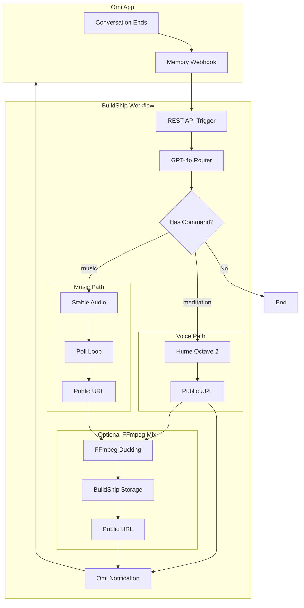

# Omi Voice Command Content Generator

**Last Updated:** December 25, 2024  
**All endpoints verified working with live tests**

---

## Key Discovery: All APIs Return Public URLs

**No BuildShip storage needed for basic generation!** AI/ML API returns CDN-hosted public URLs directly:

| Content Type | Model | Returns |
|-------------|-------|---------|
| Meditation/Voice | Hume Octave 2 | Public URL (sync) |
| Music | Stable Audio | Public URL (async poll) |
| Images | Flux Pro | Public URL (sync) |
| Videos | Sora 2 | Public URL (async poll) |

BuildShip Storage is **only needed for FFmpeg post-processing** (mixing voice + music).

---

## Architecture



---

## API Endpoints (Verified December 25, 2024)

### 1. Voice: Hume Octave 2 (Synchronous)

**Endpoint:** `POST https://api.aimlapi.com/tts`

**Request:**
```json
{
  "model": "hume/octave-2",
  "text": "Close your eyes and take a slow breath in..."
}
```

**Response:**
```json
{
  "audio": {
    "url": "https://cdn.aimlapi.com/generations/tts/hume-tts-xxx.wav"
  },
  "usage": { "characters": 177152 }
}
```

**Output:** Public URL directly (no polling needed)

---

### 2. Music: Stable Audio (Async with Polling)

**Step 1 - Start Generation:**

**Endpoint:** `POST https://api.aimlapi.com/v2/generate/audio`

```json
{
  "model": "stable-audio",
  "prompt": "Calm ambient meditation background music with soft piano"
}
```

**Response:**
```json
{
  "id": "22e6dddb-235b-40ec-8a8a-cd9c8306f1f9:stable-audio",
  "status": "queued"
}
```

**Step 2 - Poll for Completion:**

**Endpoint:** `GET https://api.aimlapi.com/v2/generate/audio?generation_id=xxx`

**Response (when complete):**
```json
{
  "status": "completed",
  "audio_file": {
    "url": "https://cdn.aimlapi.com/flamingo/files/xxx.wav",
    "file_size": 5292078
  }
}
```

---

### 3. Images: Flux Pro (Synchronous)

**Endpoint:** `POST https://api.aimlapi.com/v1/images/generations`

```json
{
  "model": "flux/pro",
  "prompt": "A peaceful winter scene",
  "size": "1024x1024"
}
```

**Response:** Returns URL directly in `data[0].url`

---

### 4. Videos: Sora 2 (Async with Polling)

Similar to music - POST to start, GET to poll.

---

## FFmpeg Audio Ducking

### When to Use

Use FFmpeg when you want polished meditation experiences by mixing voice over background music with ducking (music lowers when voice plays).

### FFmpeg Command

```bash
ffmpeg -i voice.mp3 -i background.mp3 \
  -filter_complex "[1:a]volume=0.3[m];[0:a][m]sidechaincompress=threshold=0.02:ratio=4:attack=200:release=1000[d];[0:a][d]amix=inputs=2:duration=longest" \
  -c:a libmp3lame -q:a 2 output.mp3
```

### What This Does

1. `volume=0.3` - Background music at 30%
2. `sidechaincompress` - Ducks music when voice detected
   - `threshold=0.02` - Voice detection sensitivity
   - `ratio=4` - Compression ratio (4:1)
   - `attack=200` - Duck speed (200ms)
   - `release=1000` - Return speed (1s)
3. `amix` - Combines both tracks

### BuildShip Flow for Polished Meditations

1. Generate voice (Hume) → Get URL
2. Generate music (Stable Audio) → Poll → Get URL
3. Download both files
4. FFmpeg node: Apply ducking
5. Upload to BuildShip Storage
6. Send mixed URL in notification

---

## BuildShip Nodes

### Node 1: REST API Trigger
- Path: `/omi-memory`
- Method: POST
- Query: `uid`

### Node 2: Extract Transcript
```javascript
const segments = request.body.transcript_segments || [];
const transcript = segments.map(s => s.text).join(' ');
return { transcript, uid: request.query.uid };
```

### Node 3: GPT-4o Router
System prompt detects commands and routes to correct model/endpoint.

### Node 4: HTTP Request
Calls AI/ML API with model-specific payload.

### Node 5: Poll Loop (for music/video)
Polls GET endpoint until status === "completed".

### Node 6: FFmpeg (optional)
Mixes voice + music with ducking.

### Node 7: Storage (only if FFmpeg used)
Uploads mixed file, returns public URL.

### Node 8: Notification
Sends Omi notification with public URL.

---

## Test Results (December 25, 2024)

### Hume Octave 2
- **Status:** ✅ Working
- **Response:** Public URL directly
- **Test URL:** `https://cdn.aimlapi.com/generations/tts/hume-tts-xxx.wav`

### Stable Audio
- **Status:** ✅ Working
- **Response:** Public URL after polling
- **Test URL:** `https://cdn.aimlapi.com/flamingo/files/xxx.wav`

### ElevenLabs Music
- **Status:** ✅ Working
- **Response:** Public URL after polling
- **Test URL:** `https://cdn.aimlapi.com/generations/hippopotamus/xxx.mp3`

### BuildShip Webhook
- **Status:** ✅ Working
- **Endpoint:** `https://0d2wdz.buildship.run/omi-memory`

---

## Available TTS Models

- `hume/octave-2` - Emotional, expressive (recommended)
- `elevenlabs/eleven_multilingual_v2` - Natural multilingual
- `elevenlabs/v3_alpha` - Latest ElevenLabs
- `minimax/speech-2.6-hd` - High quality
- `openai/tts-1-hd` - OpenAI HD

## Available Music Models

- `stable-audio` - Stability AI (recommended for instrumental)
- `elevenlabs/eleven_music` - ElevenLabs
- `google/lyria2` - Google Lyria

---

## Cost Estimate

| Service | Price |
|---------|-------|
| BuildShip Free | 100 exec/day |
| Hume Octave 2 | ~$0.01-0.05/call |
| Stable Audio | ~$0.05-0.10/call |
| GPT-4o routing | ~$0.01/call |
| **Monthly Total** | **$10-25** |

---

## Quick Start

1. Get AI/ML API key from https://aimlapi.com
2. Create BuildShip workflow
3. Add `AIML_API_KEY` to BuildShip secrets
4. Configure nodes as described above
5. Set Omi Developer Mode webhook URL
6. Test: "Create a meditation about gratitude"

See **CreatorSetup.md** for complete documentation.
