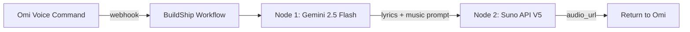

# Suno Meditation Generator (Simplified)

## What This Does

1. **LLM writes meditation lyrics** (affirmations, mantras, guided words)
2. **Suno V5 generates complete track** with those lyrics sung over music
3. **Return audio URL** to Omi

No voice-over mixing. No FFmpeg. Suno does it all.---

## Architecture



---

## BuildShip Workflow (2 Nodes)

### Node 1: Lyrics Generator (LLM)

**Model:** `google/gemini-2.5-flash` (via AIMLAPI)**Prompt:**

```javascript
Write meditation lyrics about {{topic}}. 

Format:
- 4-8 short lines
- Repetitive/mantra-like
- Calm, affirming words
- Include breathing cues like "breathe in... breathe out..."

Also provide a music style description.

Output JSON:
{
  "lyrics": "...",
  "music_prompt": "peaceful ambient meditation, soft vocals, theta waves, 432Hz, calming"
}
```


### Node 2: Suno Music Generator

**API:** `POST https://api.sunoapi.org/generate`**Request:**

```json
{
  "prompt": "{{music_prompt}}",
  "lyrics": "{{lyrics}}",
  "model": "V5",
  "callback_url": "{{optional_webhook}}"
}
```

**Response:**

```json
{
  "audio_url": "https://cdn.suno.ai/abc123.mp3",
  "duration": 180
}
```

---

## Files to Update

1. [CreatorSetup.md](CreatorSetup.md) - Add "Suno Meditation Generator" section with:

- Simple 2-node BuildShip setup
- Example lyrics prompts for different meditation types
- Suno API configuration
- Quick start checklist

---

## Example Meditation Types

| Type | Lyrics Style | Music Prompt ||------|--------------|--------------|| Affirmations | "I am worthy... I am loved..." | `soft piano, gentle vocals, affirming, peaceful` || Sleep | "Let go... drift away... rest now..." | `deep sleep music, whispered vocals, binaural, delta waves` || Morning Energy | "Rise and shine... new day begins..." | `uplifting acoustic, warm vocals, gentle percussion` || Anxiety Relief | "You are safe... breathe deeply..." | `calming ocean sounds, soft vocals, grounding` |---

## Quick Start Checklist

- [ ] Get Suno API key from [sunoapi.org](https://sunoapi.org)
- [ ] Get AIMLAPI key from [aimlapi.com](https://aimlapi.com)  
- [ ] Create BuildShip workflow with 2 nodes
- [ ] Add secrets: `SUNO_API_KEY`, `AIML_API_KEY`